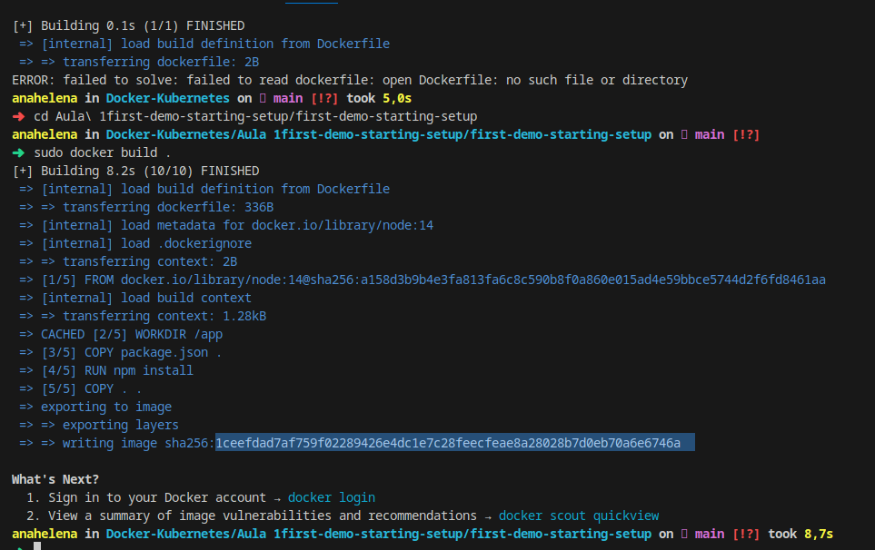

```bash

➜  sudo docker build .         
[sudo] senha para anahelena: 
[+] Building 1.7s (10/10) FINISHED                                                                                                                                                                         docker:default
 => [internal] load build definition from Dockerfile                                                                                                                                                                 0.0s
 => => transferring dockerfile: 336B                                                                                                                                                                                 0.0s
 => [internal] load metadata for docker.io/library/node:14                                                                                                                                                           1.5s
 => [internal] load .dockerignore                                                                                                                                                                                    0.0s
 => => transferring context: 2B                                                                                                                                                                                      0.0s
 => [1/5] FROM docker.io/library/node:14@sha256:a158d3b9b4e3fa813fa6c8c590b8f0a860e015ad4e59bbce5744d2f6fd8461aa                                                                                                     0.0s
 => [internal] load build context                                                                                                                                                                                    0.0s
 => => transferring context: 94.55kB                                                                                                                                                                                 0.0s
 => CACHED [2/5] WORKDIR /app                                                                                                                                                                                        0.0s
 => CACHED [3/5] COPY package.json .                                                                                                                                                                                 0.0s
 => CACHED [4/5] RUN npm install                                                                                                                                                                                     0.0s
 => [5/5] COPY . .                                                                                                                                                                                                   0.0s
 => exporting to image                                                                                                                                                                                               0.0s
 => => exporting layers                                                                                                                                                                                              0.0s
 => => writing image sha256:5fc85f9debee7117a7832915f25e66bbbb38eb6791dd76758055bd764cd2fb5c                                                                                                                         0.0s

What's Next?
  1. Sign in to your Docker account → docker login
  2. View a summary of image vulnerabilities and recommendations → docker scout quickview
```

Id da imagem

5fc85f9debee7117a7832915f25e66bbbb38eb6791dd76758055bd764cd2fb5c


sudo docker run -p 3000:3000 5fc85f9debee7117a

http://localhost:3000/


docker ps -> ver conteiners

anahelena in Docker-Kubernetes/Aula 1first-demo-starting-setup on  main [!?] 
➜  sudo docker ps
CONTAINER ID   IMAGE          COMMAND                  CREATED        STATUS        PORTS                                       NAMES
5ce76b6b401b   5fc85f9debee   "docker-entrypoint.s…"   27 hours ago   Up 27 hours   0.0.0.0:3000->3000/tcp, :::3000->3000/tcp   wizardly_nash
47916ab60a27   5fc85f9debee   "docker-entrypoint.s…"   27 hours ago   Up 27 hours   3000/tcp                                    serene_faraday
anahelena in Docker-Kubernetes/Aula 1first-demo-starting-setup on  main [!?] took 2,7s 
➜  sudo docker stop serene_faraday
serene_faraday
anahelena in Docker-Kubernetes/Aula 1first-demo-starting-setup on  main [!?] took 10,5s 
➜  