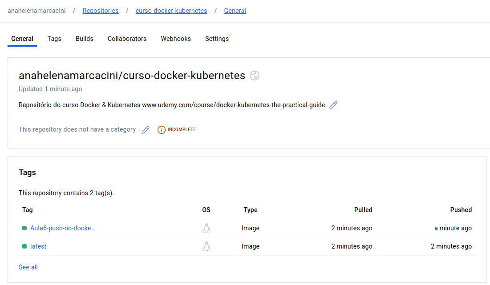

# Repositorios remotos
## Acesso do DockerHub
```
anamarcacini in Docker-Kubernetes/Aula2/nodejs-app-starting-setup on  main [?] 
➜  docker push anahelenamarcacini/curso-docker-kubernetes
Using default tag: latest
The push refers to repository [docker.io/anahelenamarcacini/curso-docker-kubernetes]
127d7a20da7a: Preparing 
58c63aecdcc5: Preparing 
1f0a00ee8561: Preparing 
77743abe757f: Preparing 
586c0b414da7: Preparing 
0bfd290f2c17: Waiting 
6d75cd01c26c: Waiting 
95904c181913: Waiting 
df69bfa94785: Waiting 
f35deb8d96fc: Waiting 
f6c2459e2059: Waiting 
f8323fb3a55c: Waiting 
2f4dc9775f33: Waiting 
denied: requested access to the resource is denied
```
Realizar login
```

anamarcacini in Docker-Kubernetes/Aula2/nodejs-app-starting-setup on  main [?] 
➜  docker login
Login with your Docker ID to push and pull images from Docker Hub. If you don't have a Docker ID, head over to https://hub.docker.com to create one.
Username: anahelenamarcacini
Password: 
WARNING! Your password will be stored unencrypted in /home/anamarcacini/.docker/config.json.
Configure a credential helper to remove this warning. See
https://docs.docker.com/engine/reference/commandline/login/#credentials-store

Login Succeeded

```
Realizar o acesso 


## Fazer Pushing para o repositório
Para criar um repositorio remoto no docker vá em https://hub.docker.com na aba repositorios e crie um novo

https://hub.docker.com/repository/docker/anahelenamarcacini/curso-docker-kubernetes/general

quando vc der push ele afirmará que não existe um repoistorio remoto com esse nome

```
anamarcacini in Docker-Kubernetes on  main [?] 
➜  docker push anahelenamarcacini/curso-docker-kubernetes   
Using default tag: latest
The push refers to repository [docker.io/anahelenamarcacini/curso-docker-kubernetes]
An image does not exist locally with the tag: anahelenamarcacini/curso-docker-kubernetes
```
O repositorio remoto deve ser igual ao repositorio local para dar push para isso podemos:

#### 1 - fazer build do repositorio com o nome certo

``` 
anamarcacini in Docker-Kubernetes/Aula2/nodejs-app-starting-setup on  main [?] 
➜  docker build -t anahelenamarcacini/curso-docker-kubernetes .

[+] Building 1.0s (10/10) FINISHED                                                                                                                                                                                                                 
 => [internal] load .dockerignore                                                                                                                                                                                                             0.0s
 => => transferring context: 2B                                                                                                                                                                                                               0.0s
 => [internal] load build definition from Dockerfile                                                                                                                                                                                          0.0s
 => => transferring dockerfile: 1.15kB                                                                                                                                                                                                        0.0s
 => [internal] load metadata for docker.io/library/node:12                                                                                                                                                                                    0.9s
 => [1/5] FROM docker.io/library/node:12@sha256:01627afeb110b3054ba4a1405541ca095c8bfca1cb6f2be9479c767a2711879e                                                                                                                              0.0s
 => [internal] load build context                                                                                                                                                                                                             0.0s
 => => transferring context: 319B                                                                                                                                                                                                             0.0s
 => CACHED [2/5] WORKDIR /app                                                                                                                                                                                                                 0.0s
 => CACHED [3/5] COPY package.json /app                                                                                                                                                                                                       0.0s
 => CACHED [4/5] RUN npm i                                                                                                                                                                                                                    0.0s
 => CACHED [5/5] COPY . /app                                                                                                                                                                                                                  0.0s
 => exporting to image                                                                                                                                                                                                                        0.0s
 => => exporting layers                                                                                                                                                                                                                       0.0s
 => => writing image sha256:5d1a45a04f2cb1aa71c042076d28670e9dc57513fb56370095c04a286fd4996d                                                                                                                                                  0.0s
 => => naming to docker.io/anahelenamarcacini/curso-docker-kubernetes:latest     
```
porem o recomendado para não perder as configurações posteriores é 

___REMOVENDO O ANTERIOR___
```
anamarcacini in Docker-Kubernetes on  main [?] 
➜  docker image rm 5d1a45a04f2c
Error response from daemon: conflict: unable to delete 5d1a45a04f2c (must be forced) - image is being used by stopped container e5ca2d39a38e
anamarcacini in Docker-Kubernetes on  main [?] 
➜  docker rm e5ca2d39a38e 
e5ca2d39a38e
anamarcacini in Docker-Kubernetes on  main [?] 
➜  docker image rm 5d1a45a04f2c
Untagged: anahelenamarcacini/curso-docker-kubernetes:latest
Deleted: sha256:5d1a45a04f2cb1aa71c042076d28670e9dc57513fb56370095c04a286fd4996d
```

#### 2 - alterar o nome de uma imagem existente
Imagem já existente

```bash
anamarcacini in Docker-Kubernetes/Aula2/nodejs-app-starting-setup on  main [?] 
➜  docker build -t docker-existente .

[+] Building 0.9s (10/10) FINISHED                                                                                                                                                                                                                 
 => [internal] load build definition from Dockerfile                                                                                                                                                                                          0.0s
 => => transferring dockerfile: 1.15kB                                                                                                                                                                                                        0.0s
 => [internal] load .dockerignore                                                                                                                                                                                                             0.0s
 => => transferring context: 2B                                                                                                                                                                                                               0.0s
 => [internal] load metadata for docker.io/library/node:12                                                                                                                                                                                    0.8s
 => [internal] load build context                                                                                                                                                                                                             0.0s
 => => transferring context: 319B                                                                                                                                                                                                             0.0s
 => [1/5] FROM docker.io/library/node:12@sha256:01627afeb110b3054ba4a1405541ca095c8bfca1cb6f2be9479c767a2711879e                                                                                                                              0.0s
 => CACHED [2/5] WORKDIR /app                                                                                                                                                                                                                 0.0s
 => CACHED [3/5] COPY package.json /app                                                                                                                                                                                                       0.0s
 => CACHED [4/5] RUN npm i                                                                                                                                                                                                                    0.0s
 => CACHED [5/5] COPY . /app                                                                                                                                                                                                                  0.0s
 => exporting to image                                                                                                                                                                                                                        0.0s
 => => exporting layers                                                                                                                                                                                                                       0.0s
 => => writing image sha256:5d1a45a04f2cb1aa71c042076d28670e9dc57513fb56370095c04a286fd4996d                                                                                                                                                  0.0s
 => => naming to docker.io/library/docker-existente:latest     
anamarcacini in Docker-Kubernetes/Aula2/nodejs-app-starting-setup on  main [?] 
➜  docker images 
REPOSITORY                     TAG                       IMAGE ID       CREATED          SIZE
docker-existente               latest                    5d1a45a04f2c   25 minutes ago   923MB
prom/prometheus                latest                    ecb74a3b23a9   3 months ago     272MB
emqx/emqx-exporter             latest                    ca45cb23de53   3 months ago     23MB
ldonini/ocpp1.6-charge-point   latest                    6d9280c72718   4 months ago     14.1MB
confluentinc/cp-kafka          7.6.0                     d87a8d474634   5 months ago     806MB
confluentinc/cp-zookeeper      7.6.0                     dde21b49609f   5 months ago     806MB
telegraf                       1.29.3-alpine             13241837fe53   6 months ago     236MB
wordpress                      latest                    bd918e5d2324   9 months ago     666MB
eclipse-mosquitto              2.0.15-openssl            e94a611cbcdf   12 months ago    8.88MB
mysql                          5.7                       3b85be0b10d3   12 months ago    581MB
rogeriocassares/yolo_v8        0.1-amd64-gpu             889ab587d24f   13 months ago    10.5GB
tensorflow/tensorflow          nightly-jupyter           778a866769be   13 months ago    1.92GB
nvidia/cuda                    11.6.2-base-ubuntu20.04   af978b91c939   13 months ago    154MB
emqx/emqx-enterprise           5.0.4                     b9a72e1c0ec9   14 months ago    412MB
emqx/mqttx-cli                 v1.9.3                    2eb302eb8513   14 months ago    201MB
hello-world                    latest                    9c7a54a9a43c   15 months ago    13.3kB
tensorflow/tensorflow          latest-gpu                cbe3a4f4c2a0   16 months ago    6.8GB
grafana/grafana                9.3.2                     83f377cc32a0   20 months ago    317MB
wurstmeister/kafka             2.12-2.3.0                eea608a69fa5   4 years ago      422MB
wurstmeister/zookeeper         latest                    3f43f72cb283   5 years ago      510MB
anamarcacini in Docker-Kubernetes/Aula2/nodejs-app-starting-setup on  main [?] 
```
Renomeando a Imagem já existente
```
➜  docker tag docker-existente:latest anahelenamarcacini/curso-docker-kubernetes   
➜  docker tag docker-existente:latest anahelenamarcacini/curso-docker-kubernetes:Aula6-push-no-dockerhub


anamarcacini in Docker-Kubernetes/Aula2/nodejs-app-starting-setup on  main [?] 
➜  docker images                                                                                        
REPOSITORY                                   TAG                       IMAGE ID       CREATED          SIZE
anahelenamarcacini/curso-docker-kubernetes   Aula6-push-no-dockerhub   5d1a45a04f2c   29 minutes ago   923MB
anahelenamarcacini/curso-docker-kubernetes   latest                    5d1a45a04f2c   29 minutes ago   923MB
docker-existente                             latest                    5d1a45a04f2c   29 minutes ago   923MB
prom/prometheus                              latest                    ecb74a3b23a9   3 months ago     272MB
emqx/emqx-exporter                           latest                    ca45cb23de53   3 months ago     23MB
ldonini/ocpp1.6-charge-point                 latest                    6d9280c72718   4 months ago     14.1MB
confluentinc/cp-kafka                        7.6.0                     d87a8d474634   5 months ago     806MB
confluentinc/cp-zookeeper                    7.6.0                     dde21b49609f   5 months ago     806MB
telegraf                                     1.29.3-alpine             13241837fe53   6 months ago     236MB
wordpress                                    latest                    bd918e5d2324   9 months ago     666MB
eclipse-mosquitto                            2.0.15-openssl            e94a611cbcdf   12 months ago    8.88MB
mysql                                        5.7                       3b85be0b10d3   12 months ago    581MB
rogeriocassares/yolo_v8                      0.1-amd64-gpu             889ab587d24f   13 months ago    10.5GB
tensorflow/tensorflow                        nightly-jupyter           778a866769be   13 months ago    1.92GB
nvidia/cuda                                  11.6.2-base-ubuntu20.04   af978b91c939   13 months ago    154MB
emqx/emqx-enterprise                         5.0.4                     b9a72e1c0ec9   14 months ago    412MB
emqx/mqttx-cli                               v1.9.3                    2eb302eb8513   14 months ago    201MB
hello-world                                  latest                    9c7a54a9a43c   15 months ago    13.3kB
tensorflow/tensorflow                        latest-gpu                cbe3a4f4c2a0   16 months ago    6.8GB
grafana/grafana                              9.3.2                     83f377cc32a0   20 months ago    317MB
wurstmeister/kafka                           2.12-2.3.0                eea608a69fa5   4 years ago      422MB
wurstmeister/zookeeper                       latest                    3f43f72cb283   5 years ago      510MB
anamarcacini in Docker-Kubernetes/Aula2/nodejs-app-starting-setup on  main [?] 
➜  
```

### Agora com o repositorio local de mesmo nome do remoto é possivel realizar push

```
➜  docker push anahelenamarcacini/curso-docker-kubernetes
Using default tag: latest
The push refers to repository [docker.io/anahelenamarcacini/curso-docker-kubernetes]
127d7a20da7a: Pushed 
58c63aecdcc5: Pushed 
1f0a00ee8561: Pushed 
77743abe757f: Pushed 
586c0b414da7: Mounted from library/node 
0bfd290f2c17: Mounted from library/node 
6d75cd01c26c: Mounted from library/node 
95904c181913: Mounted from library/node 
df69bfa94785: Mounted from library/node 
f35deb8d96fc: Mounted from library/node 
f6c2459e2059: Mounted from library/node 
f8323fb3a55c: Mounted from library/node 
2f4dc9775f33: Mounted from library/node 
latest: digest: sha256:a648779d373f90dcd4d5db8f379745e02b141ea334941194c15fcceed70a4fc8 size: 3048
anamarcacini in Docker-Kubernetes/Aula2/nodejs-app-starting-setup on  main [?] took 12,3s 
➜  docker push anahelenamarcacini/curso-docker-kubernetes:Aula6-push-no-dockerhub 
The push refers to repository [docker.io/anahelenamarcacini/curso-docker-kubernetes]
127d7a20da7a: Layer already exists 
58c63aecdcc5: Layer already exists 
1f0a00ee8561: Layer already exists 
77743abe757f: Layer already exists 
586c0b414da7: Layer already exists 
0bfd290f2c17: Layer already exists 
6d75cd01c26c: Layer already exists 
95904c181913: Layer already exists 
df69bfa94785: Layer already exists 
f35deb8d96fc: Layer already exists 
f6c2459e2059: Layer already exists 
f8323fb3a55c: Layer already exists 
2f4dc9775f33: Layer already exists 
Aula6-push-no-dockerhub: digest: sha256:a648779d373f90dcd4d5db8f379745e02b141ea334941194c15fcceed70a4fc8 size: 3048

```




## Fazer Pulling
docker image prune -a --> apaga todas as suas imagens locais não utilizadas em containers
ou
docker image rm anahelenamarcacini/curso-docker-kubernetes:Aula6-push-no-dockerhub


```
anamarcacini in Docker-Kubernetes/Aula2/nodejs-app-starting-setup on  main [?] 
➜  docker pull anahelenamarcacini/curso-docker-kubernetes:Aula6-push-no-dockerhub
Aula6-push-no-dockerhub: Pulling from anahelenamarcacini/curso-docker-kubernetes
Digest: sha256:a648779d373f90dcd4d5db8f379745e02b141ea334941194c15fcceed70a4fc8
Status: Downloaded newer image for anahelenamarcacini/curso-docker-kubernetes:Aula6-push-no-dockerhub
docker.io/anahelenamarcacini/curso-docker-kubernetes:Aula6-push-no-dockerhub
anamarcacini in Docker-Kubernetes/Aula2/nodejs-app-starting-setup on  main [?] 
➜  
```
Fazendo push de outras pessoas
```


anamarcacini in Docker-Kubernetes/Aula2/nodejs-app-starting-setup on  main [?] 
➜  docker pull academind/node-hello-world
Using default tag: latest
latest: Pulling from academind/node-hello-world
419e7ae5bb1e: Pull complete 
848839e0cd3b: Pull complete 
de30e8b35015: Pull complete 
258fdea6ea48: Pull complete 
ddb75eb7f1e9: Pull complete 
7ec8a0667334: Pull complete 
1a5a0fcc10a7: Pull complete 
7137cb3a58d4: Pull complete 
0725fe303059: Pull complete 
5472ee660c2a: Pull complete 
0e2b696290c3: Pull complete 
9c74de367b21: Pull complete 
be08011511a7: Pull complete 
Digest: sha256:7214ae016bd22c5b1dacfdb8dea50822fe4ec5c365355bf2acc193774cfb412a
Status: Downloaded newer image for academind/node-hello-world:latest
docker.io/academind/node-hello-world:latest


```
acessando http://localhost:8000/
Encerrando

```
anamarcacini in Docker-Kubernetes on  main [?] 
➜  docker stop a524f3f8c240
a524f3f8c240
anamarcacini in Docker-Kubernetes on  main [?] took 10,3s 
➜  docker ps -a            
CONTAINER ID   IMAGE                                 COMMAND                  CREATED        STATUS                      PORTS                                                                                                                                              NAMES
7a72fa551af3   ldonini/ocpp1.6-charge-point:latest   "charge_point"           2 months ago   Exited (0) 2 months ago                                                                                                                                                        charge-point
12a68437afd9   emqx/emqx-exporter                    "/usr/local/emqx-exp…"   2 months ago   Exited (1) 2 months ago                                                                                                                                                        emqx-exporter
57f0d56ab7cf   emqx/mqttx-cli:v1.9.3                 "docker-entrypoint.s…"   2 months ago   Exited (255) 2 months ago                                                                                                                                                      mqttx
527af726e6fb   emqx/mqttx-cli:v1.9.3                 "docker-entrypoint.s…"   2 months ago   Exited (255) 2 months ago                                                                                                                                                      mqttx-simulate
ffe495b26acd   emqx/emqx-enterprise:5.0.4            "/usr/bin/docker-ent…"   2 months ago   Exited (255) 2 months ago   4370/tcp, 5369/tcp, 8083-8084/tcp, 8883/tcp, 11883/tcp, 0.0.0.0:18083->18083/tcp, :::18083->18083/tcp, 0.0.0.0:1884->1883/tcp, :::1884->1883/tcp   emqx
69bcc041d5b7   wurstmeister/kafka:2.12-2.3.0         "start-kafka.sh"         2 months ago   Exited (255) 2 months ago   0.0.0.0:9092->9092/tcp, :::9092->9092/tcp                                                                                                          kafka
01a86d4c02e4   prom/prometheus                       "/bin/prometheus --c…"   2 months ago   Exited (255) 2 months ago   0.0.0.0:9090->9090/tcp, :::9090->9090/tcp                                                                                                          prometheus
5c0be17aab02   anamarcacini in Docker-Kubernetes on  main [?] 
➜  docker stop a524f3f8c240
a524f3f8c240
anamarcacini in Docker-Kubernetes on  main [?] took 10,3s 
➜  docker ps -a            
CONTAINER ID   IMAGE                                 COMMAND                  CREATED        STATUS                      PORTS                                                                                                                                              NAMES
7a72fa551af3   ldonini/ocpp1.6-charge-point:latest   "charge_point"           2 months ago   Exited (0) 2 months ago                                                                                                                                                        charge-point
12a68437afd9   emqx/emqx-exporter                    "/usr/local/emqx-exp…"   2 months ago   Exited (1) 2 months ago                                                                                                                                                        emqx-exporter
57f0d56ab7cf   emqx/mqttx-cli:v1.9.3                 "docker-entrypoint.s…"   2 months ago   Exited (255) 2 months ago                                                                                                                                                      mqttx
527af726e6fb   emqx/mqttx-cli:v1.9.3                 "docker-entrypoint.s…"   2 months ago   Exited (255) 2 months ago                                                                                                                                                      mqttx-simulate
ffe495b26acd   emqx/emqx-enterprise:5.0.4            "/usr/bin/docker-ent…"   2 months ago   Exited (255) 2 months ago   4370/tcp, 5369/tcp, 8083-8084/tcp, 8883/tcp, 11883/tcp, 0.0.0.0:18083->18083/tcp, :::18083->18083/tcp, 0.0.0.0:1884->1883/tcp, :::1884->1883/tcp   emqx
69bcc041d5b7   wurstmeister/kafka:2.12-2.3.0         "start-kafka.sh"         2 months ago   Exited (255) 2 months ago   0.0.0.0:9092->9092/tcp, :::9092->9092/tcp                                                                                                          kafka
01a86d4c02e4   prom/prometheus                       "/bin/prometheus --c…"   2 months ago   Exited (255) 2 months ago   0.0.0.0:9090->9090/tcp, :::9090->9090/tcp                                                                                                          prometheus
5c0be17aab02   wurstmeister/zookeeper                "/bin/sh -c '/usr/sb…"   2 months ago   Exited (255) 2 months ago   22/tcp, 2888/tcp, 3888/tcp, 0.0.0.0:2181->2181/tcp, :::2181->2181/tcp                                                                              zookeeper
965e15342d14   grafana/grafana:9.3.2                 "/run.sh"                2 months ago   Exited (255) 2 months ago   0.0.0.0:3000->3000/tcp, :::3000->3000/tcp                                                                                                          grafana
anamarcacini in Docker-Kubernetes on  main [?] wurstmeister/zookeeper                "/bin/sh -c '/usr/sb…"   2 months ago   Exited (255) 2 months ago   22/tcp, 2888/tcp, 3888/tcp, 0.0.0.0:2181->2181/tcp, :::2181->2181/tcp                                                                              zookeeper
965e15342d14   grafana/grafana:9.3.2                 "/run.sh"                2 months ago   Exited (255) 2 months ago   0.0.0.0:3000->3000/tcp, :::3000->3000/tcp                                                                                                          grafana
anamarcacini in Docker-Kubernetes on  main [?] 
```

### OBS: Não precisa do pull
Removendo a imagem atual
```anamarcacini in Docker-Kubernetes on  main [?] 
➜  docker images
REPOSITORY                                   TAG                       IMAGE ID       CREATED          SIZE
anahelenamarcacini/curso-docker-kubernetes   Aula6-push-no-dockerhub   5d1a45a04f2c   52 minutes ago   923MB
docker-existente                             latest                    5d1a45a04f2c   52 minutes ago   923MB
prom/prometheus                              latest                    ecb74a3b23a9   3 months ago     272MB
emqx/emqx-exporter                           latest                    ca45cb23de53   3 months ago     23MB
ldonini/ocpp1.6-charge-point                 latest                    6d9280c72718   4 months ago     14.1MB
confluentinc/cp-kafka                        7.6.0                     d87a8d474634   5 months ago     806MB
confluentinc/cp-zookeeper                    7.6.0                     dde21b49609f   5 months ago     806MB
telegraf                                     1.29.3-alpine             13241837fe53   6 months ago     236MB
wordpress                                    latest                    bd918e5d2324   9 months ago     666MB
eclipse-mosquitto                            2.0.15-openssl            e94a611cbcdf   12 months ago    8.88MB
mysql                                        5.7                       3b85be0b10d3   12 months ago    581MB
rogeriocassares/yolo_v8                      0.1-amd64-gpu             889ab587d24f   13 months ago    10.5GB
tensorflow/tensorflow                        nightly-jupyter           778a866769be   13 months ago    1.92GB
nvidia/cuda                                  11.6.2-base-ubuntu20.04   af978b91c939   13 months ago    154MB
emqx/emqx-enterprise                         5.0.4                     b9a72e1c0ec9   14 months ago    412MB
emqx/mqttx-cli                               v1.9.3                    2eb302eb8513   14 months ago    201MB
hello-world                                  latest                    9c7a54a9a43c   15 months ago    13.3kB
tensorflow/tensorflow                        latest-gpu                cbe3a4f4c2a0   16 months ago    6.8GB
grafana/grafana                              9.3.2                     83f377cc32a0   20 months ago    317MB
academind/node-hello-world                   latest                    aa7906e341fd   3 years ago      946MB
wurstmeister/kafka                           2.12-2.3.0                eea608a69fa5   4 years ago      422MB
wurstmeister/zookeeper                       latest                    3f43f72cb283   5 years ago      510MB
anamarcacini in Docker-Kubernetes on  main [?] 
➜  docker image rm academind/node-hello-world                                                                                                                                                                                              
Untagged: academind/node-hello-world:latest
Untagged: academind/node-hello-world@sha256:7214ae016bd22c5b1dacfdb8dea50822fe4ec5c365355bf2acc193774cfb412a
Deleted: sha256:aa7906e341fd74f3475cbfac7aa415e42d4d8f3ce6f61d8eec01fcfb70edafce
Deleted: sha256:4e38a1c48b1fa1a36a1140bd1710d8fbfac37800edaea000b7a0b8e6ad06c20c
Deleted: sha256:e509c08c0cf32144c2ad22fae2718200f10b3c6ddb6060034f22fbb8d080bbf3
Deleted: sha256:8de7a447580d19741394f9c6446909a06a4f3e838c76bf792d16890b8e4824b3
Deleted: sha256:ad308a5663bcb2dd8b4155445753be82ee769e4fead6ff2288bced30e14b2af6
Deleted: sha256:6ed3c8d6f4efa9cdcb9a014cc919428c2b351516cf0b2ff9204c9de01e5e209a
Deleted: sha256:b3ea194b1124baea6bc3ec21e30ccb7c02022b60688bbb69cc25e6026a6909e9
Deleted: sha256:9305190f55b39839e17532aec46715e121f00a3f1737f7e1155fa0aaaa7eb053
Deleted: sha256:a5148474e7ce0a8a2b695e50b6f286cb1a42efd7ecdbc78fa61fbe0e6be5c4d0
Deleted: sha256:c11a941033807a7ff641242a0e933fefe7c9ba5bc078596f9a535a8385f3f124
Deleted: sha256:12b655ddd5543bba6d0bb263edad5c4440aa05e7bf207a17031984eb55d48fda
Deleted: sha256:ec2cbfca075a717928b072100ca1d70b7a95fe5b8ecdf9418824a44a839e255e
Deleted: sha256:438031af5d1e5a47e5edef5a986f6a6549f9f05dc067b9e39f79b05c7c10370e
Deleted: sha256:4e38024e7e09292105545a625272c47b49dbd1db721040f2e85662e0a41ad587
anamarcacini in Docker-Kubernetes on  main [?] 
anamarcacini in Docker-Kubernetes on  main [?] 
➜  docker images                             
REPOSITORY                                   TAG                       IMAGE ID       CREATED          SIZE
anahelenamarcacini/curso-docker-kubernetes   Aula6-push-no-dockerhub   5d1a45a04f2c   54 minutes ago   923MB
docker-existente                             latest                    5d1a45a04f2c   54 minutes ago   923MB
prom/prometheus                              latest                    ecb74a3b23a9   3 months ago     272MB
emqx/emqx-exporter                           latest                    ca45cb23de53   3 months ago     23MB
ldonini/ocpp1.6-charge-point                 latest                    6d9280c72718   4 months ago     14.1MB
confluentinc/cp-kafka                        7.6.0                     d87a8d474634   5 months ago     806MB
confluentinc/cp-zookeeper                    7.6.0                     dde21b49609f   5 months ago     806MB
telegraf                                     1.29.3-alpine             13241837fe53   6 months ago     236MB
wordpress                                    latest                    bd918e5d2324   9 months ago     666MB
eclipse-mosquitto                            2.0.15-openssl            e94a611cbcdf   12 months ago    8.88MB
mysql                                        5.7                       3b85be0b10d3   12 months ago    581MB
rogeriocassares/yolo_v8                      0.1-amd64-gpu             889ab587d24f   13 months ago    10.5GB
tensorflow/tensorflow                        nightly-jupyter           778a866769be   13 months ago    1.92GB
nvidia/cuda                                  11.6.2-base-ubuntu20.04   af978b91c939   13 months ago    154MB
emqx/emqx-enterprise                         5.0.4                     b9a72e1c0ec9   14 months ago    412MB
emqx/mqttx-cli                               v1.9.3                    2eb302eb8513   14 months ago    201MB
hello-world                                  latest                    9c7a54a9a43c   15 months ago    13.3kB
tensorflow/tensorflow                        latest-gpu                cbe3a4f4c2a0   16 months ago    6.8GB
grafana/grafana                              9.3.2                     83f377cc32a0   20 months ago    317MB
wurstmeister/kafka                           2.12-2.3.0                eea608a69fa5   4 years ago      422MB
wurstmeister/zookeeper                       latest                    3f43f72cb283   5 years ago      510MB
```

É possível apenas executar o docker run e se o docker não encontrar a imagem localmente ele busca no git hub
o problema é que ele não verifica se houve atualizações
    caso rode duas vezes ele terá localmente o repositorio e não mais remotamente 
    Não necessáriamente o seu local está mais atualizado que o remoto


